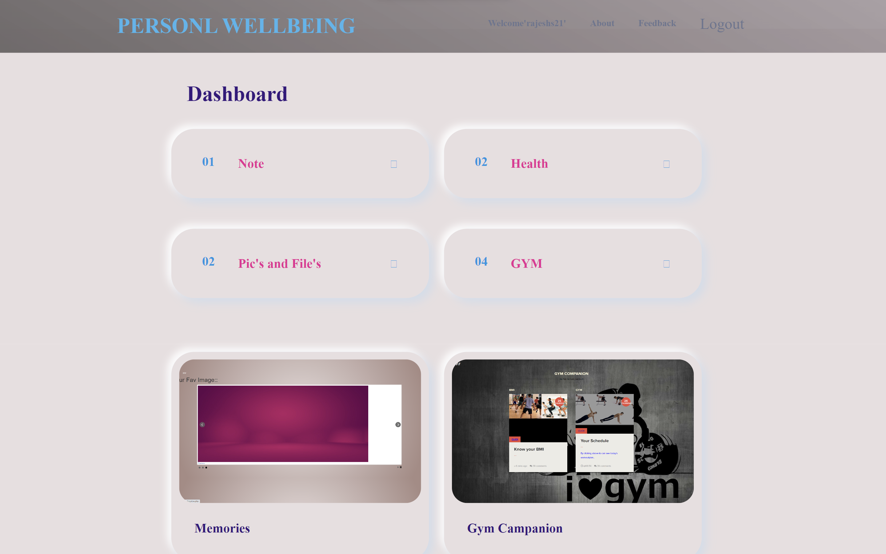

# WhereInTheWorld


## Overview

WhereInTheWorld is a web application that allows users to fetch information about countries, states, and cities, and submit a form to save their location data.

## Features

- Fetch information about countries, states, and cities.
- Allow users to submit their location information.
- Store user-submitted data in a MySQL database.

## Getting Started

These instructions will help you set up and run the project on your local machine.

### Prerequisites

- [XAMPP](https://www.apachefriends.org/index.html) installed on your machine.

### Installation

1. Clone the repository to your local machine:

   ```bash
   git clone https://github.com/yourusername/WhereInTheWorld.git
   ```

2. Move the project folder to the `htdocs` directory of your XAMPP installation.

3. Start the Apache and MySQL servers using the XAMPP control panel.

4. Open your web browser and navigate to `http://localhost/WhereInTheWorld`.

## Database Setup

1. Open phpMyAdmin by going to `http://localhost/phpmyadmin` in your web browser.

2. Create a new database named `whereintheworld`.

3. Import the provided SQL file located at `database/whereintheworld.sql`.

## Usage

1. Open your web browser and navigate to `http://localhost/WhereInTheWorld`.

2. Explore the application to fetch country, state, and city information.

3. Fill out the form to submit your location data.

## Contributing

If you'd like to contribute to this project, please follow these steps:

1. Fork the repository.

2. Create a new branch.

3. Make your changes and commit them.

4. Push to your fork and submit a pull request.

## License

This project is licensed under the MIT License - see the [LICENSE](LICENSE) file for details.

## Acknowledgments

- Special thanks to [RESTcountries](https://restcountries.com/) for providing country data.
- Thanks to the [XAMPP](https://www.apachefriends.org/index.html) team for the web server environment.

## Contact

For questions or feedback, please contact [Rajesh S](mailto:rajeshs09858@gmail.com).

## Screenshots




## Roadmap

- Implement user authentication for personalized experiences.
- Add a feature to search for specific locations.

## Known Issues

- None at the moment.
```
